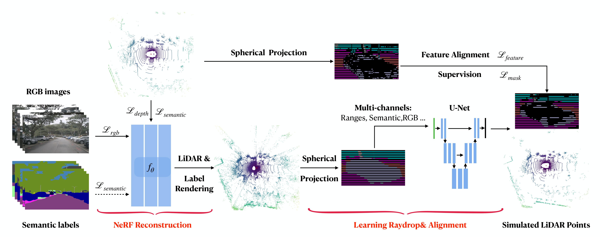
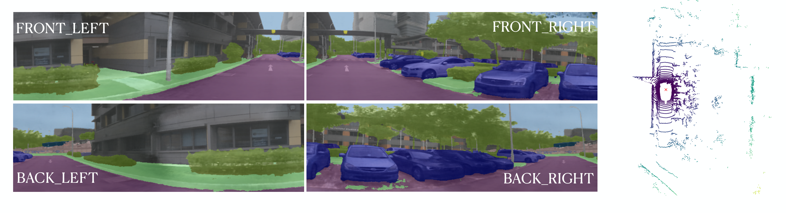
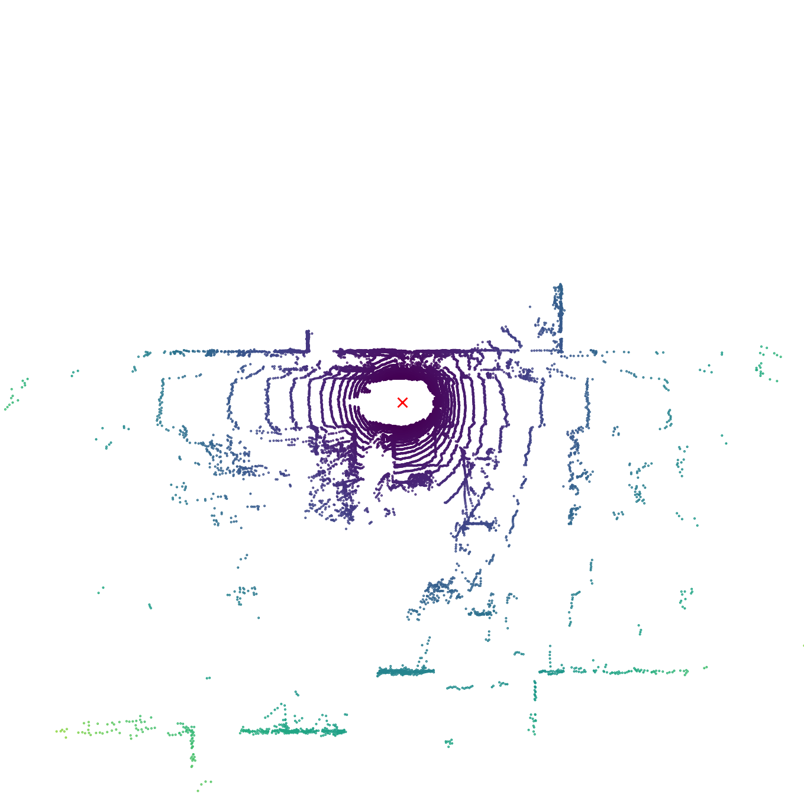
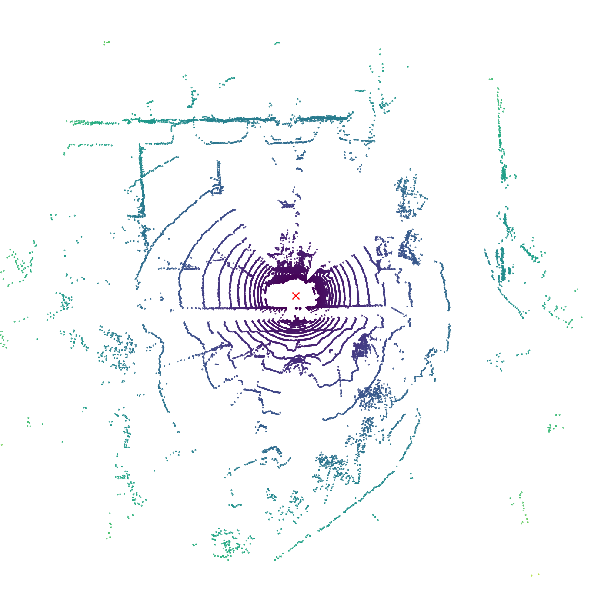
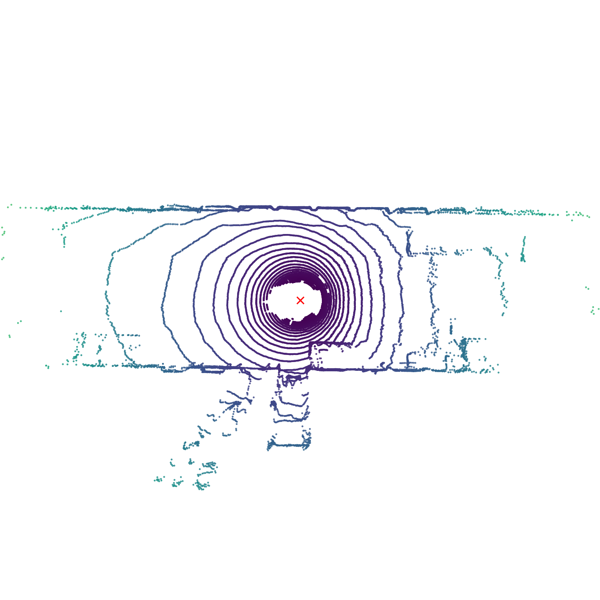
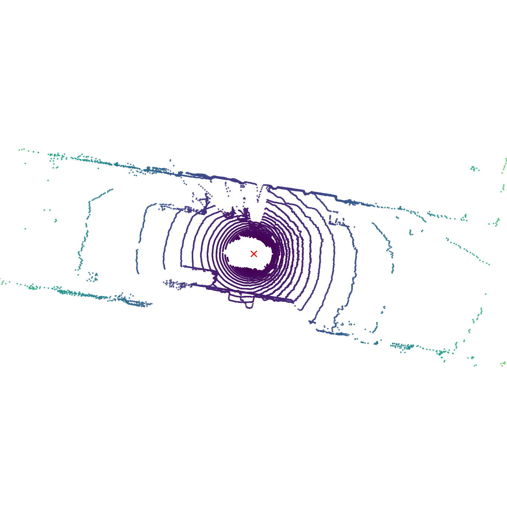

# NeRF-LiDAR: Generating Realistic LiDAR Point Clouds with Neural Radiance Fields
### [[Paper]](https://arxiv.org/abs/2304.14811) 
> [**NeRF-LiDAR: Generating Realistic LiDAR Point Clouds with Neural Radiance Fields**](https://arxiv.org/abs/2304.14811),            
> Junge Zhang, Feihu Zhang, Shaochen kuang, [Li Zhang](https://lzrobots.github.io)  
> **AAAI 2024**

**Official implementation for NeRF-LiDAR: Generating Realistic LiDAR Point Clouds with Neural Radiance Fields**
<br>
Labelling LiDAR point clouds for training autonomous driving is extremely expensive and difficult. LiDAR simulation aims at generating realistic LiDAR data with labels for training and verifying self-driving algorithms more efficiently. Recently, Neural Radiance Fields (NeRF) have been proposed for novel view synthesis  using implicit reconstruction of 3D scenes. Inspired by this, we present NeRF-LIDAR, a novel LiDAR simulation method that leverages real-world information to generate realistic LIDAR point clouds. Different from existing LiDAR simulators, we use real images and point cloud data collected by self-driving cars to learn the 3D scene representation, point cloud generation and label rendering. We verify the effectiveness of our NeRF-LiDAR  by training different 3D segmentation models on the generated LiDAR point clouds. It reveals that the trained models are able to achieve similar accuracy when compared with the same model trained on the real LiDAR data.  Besides, the generated data is capable of  boosting the accuracy through pre-training which helps reduce the requirements of the real labeled data. 
## 🛠️ Pipeline
<div align="center">
  
</div><br/>


## 🏙 Results

### Sensor fusion
NeRF-LiDAR can also render high-quality RGB novel views along the the LiDAR. We simulate a 4 cameras and one
LiDAR sensor configuration that is different from the neScenes configuration in the training dataset.
<div align="center">
  
</div><br/>

### Simulation
Our NeRF-LiDAR can generate realistic point clouds that is nearly the same as the real LiDAR point clouds.
<p float="left" width="100%">
  
   
   
  
</p>


## Bibtex
```
@inproceedings{zhang2023nerf,
  title={NeRF-LiDAR: Generating Realistic LiDAR Point Clouds with Neural Radiance Fields},
  author={Zhang, Junge and Zhang, Feihu and Kuang, Shaochen and Zhang, Li},
  booktitle={Association for the Advancement of Artificial Intelligence (AAAI)},
  year={2024}
}
```